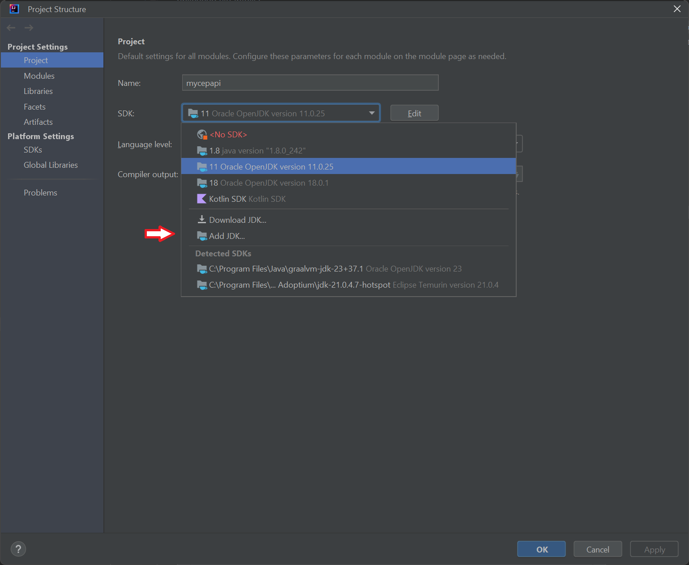
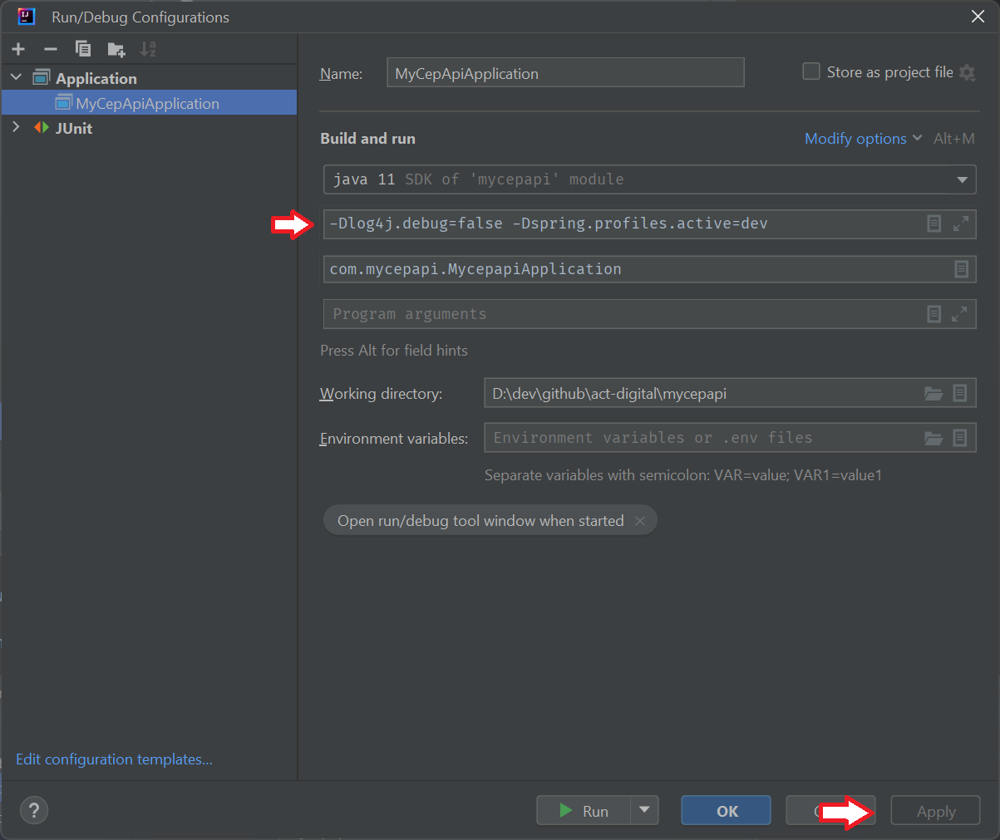

# MyCEPAPI

## Descrição

Aplicação Java com Spring Boot que implementa uma API REST para buscar CEPs e gravar os logs das consultas em um banco de dados PostgreSQL.

## Pré-requisitos

- Docker
- Docker Compose
- Java 11

## Como executar

### Executando pelo IntelliJ

1. Clone o repositório:

```bash
git clone https://github.com/stakah/mycepapi.git
cd mycepapi
```

2. Configure as variáveis de ambiente no arquivo .env:

```properties
POSTGRES_DB=mycepdb
POSTGRES_USER=myuser
POSTGRES_PASSWORD=mypassword
```

#### Variaveis de ambiente para desenvolvimento no IntelliJ

Da mesma forma que o arquivo `.env`, existe o arquivo `dev.env` com
as variáveis de ambiente para serem utilizadas quando estiver
desenvolvendo/testando a aplicação via IntelliJ.

Esse arquivo contém as mesmas variáveis de ambiente do arquivo `.env`
mas, com pequenas variações nos `hosts` e `ports` pois
quando a aplicação está sendo executada fora de um container Docker,
essa consegue acessar os serviços via `port mapping` como se os
serviços estivessem sendo executados na própria máquina (`localhost`).

#### Configurando o IntelliJ

Para executar o projeto no IntelliJ, é preciso:

1. importar o projeto como Maven
2. configurar o projeto para utlizar Java 11
3. configurar os parâmetros de execução do projeto

#### Importar o projeto como Maven

Abra o IntelliJ, selecione o menu File > Open ... e selecione
a pasta onde o projeto MyCEPAPI está e selecione o arquivo `pom.xml`
para abrir. O IntelliJ irá perguntar para importar como um projeto Maven.


#### Configurar o projeto para utilizar Java 11

Abra o menu File > Project Structure ... e selecione a opção
Project Structure, Project. Selecione o Java 11 instalado no menu SDK.


Caso não apareça a opção do java 11, então selecione Add JDK ... 
abra a pasta onde o Java 11 está instalado.



#### Configurar os parâmetros de execução do projeto

Abra o menu Run > Edit Configurations ...
Na janela Run/Debug Configurations, clique no botão '+' para
criar uma nova configuração de execução e selecione a opção Application.


Preencha o nome dessa configuração, por exemplo, `MyCepApiApplication`.

Certifique que esteja selecionado Java 11 para o campo Build and Run.

Selecione a classe `com.mycepapi.MycepapiApplication` para o Main Class.


Cique no botão 'OK' para criar a configuração de execução.

Abra novamente o menu Run > Edit Configurations ... e selecione a configuração
de execução criada. 


Clique em `Modify Options` e marque a opção
`Add VM Options`. Preencha o campo `VM Options` com
`-Dlog4j.debug=false -Dspring.profiles.active=dev`




Preencha o campo `Environment Variables` selecionando o botão com
o ícone de Pasta e aponte para o arquivo `dev.env` na raíz do projeto.

Clique no botão `Apply` para salvar as alterações.


Para executar, basta clicar no botão `Run`.

### Execute o Docker Compose:

Para executar os containers do PostgreSQL, do WireMock e do PgAdmin,
utilize o script `run-dev-docker-compose.bat`

```bash
run-dev-docker-compose.bat
```

### Parando os containers do Docker Compose:

Para parar os containers do PostgreSQL, do WireMock e do PgAdmin,
utilise o script `stop-dev-docker-compose.bat`

```bash
stop-dev-docker-compose.bat
```

[](https://asciinema.org/a/bDRx5WypjuQQOcQ8s39ddUCmL)

Para executar todos os containers e a aplicação MyCEPApi como um
container docker, utilize o script `run-all-docker-compose.bat`

```bash
run-all-docker-compose.bat
```

Para parar todos os containers, incluindo o container da aplicação
MyCEPAPI, utilize o script `stop-all-docker-compose.bat`

```bash
stop-all-docker-compose.bat
```

[](https://asciinema.org/a/g5xQAGXAd3cK5CAcIi8apDgyG)

### Build do projeto

Para fazer o build do projeto via Maven e gerar o arquivo JAR,
utilize o script `build-mycepapi.cmd`

```bash
build-mycepapi.cmd
```

Para fazer o build do projeto e gerar a imagem Docker da aplicação,
utilize o script `build-docker-image.cmd`

```bash
build-docker-image.cmd
```

## Executando o projeto como container Docker

Para executar o projeto como um container Docker mas fora Docker Compose,
utilize o script `run-docker-mycepapi.bat`.

Antes de executar, gere o arquivo JAR e a imagem Docker utilizando o script
`build-docker-image.cmd`

```bash
build-docker-image.cmd

run-docker-mycepapi.bat
```

## Endpoints

* `GET /api/cep/{cep}`: Busca informações de um CEP e grava o log da consulta.

## Estrutura do Projeto

```
my-cep-api
|-- src
|   |-- main
|   |   |-- java
|   |   |   |-- com
|   |   |   |   |-- mycepapi
|   |   |   |   |   |-- controller
|   |   |   |   |   |-- service
|   |   |   |   |   |-- model
|   |   |   |   |   |-- repository
|   |   |-- resources
|   |   |   |-- application.properties
|-- pom.xml
```

## Dependências

* Spring Boot Starter Web

* Spring Boot Starter Data JPA

* H2 Database

* OpenFeign

* PostgreSQL Driver

## Configuração do Banco de Dados

O banco de dados PostgreSQL é configurado no arquivo `application.properties`:

```properties
spring.datasource.url=jdbc:postgresql://${POSTGRES_HOST}:${POSTGRES_PORT}/${POSTGRES_DB}
spring.datasource.username=${POSTGRES_USER}
spring.datasource.password=${POSTGRES_PASSWORD}
```

O arquivo `application-dev.properties` possui apenas uma propriedade
para que o Hibernate/JPA recrie as tabelas do banco de dados PostreSQL
sempre que a aplicação for executada com o `profile=dev`.

```properties
spring.jpa.hibernate.ddl-auto=create
```

## Configuração do Wiremock

A configuração do Wiremock é feita pelo Docker Compose, mapeando
algumas pastas do container para a pasta `wiremock_data`. Apenas
dois arquivos JSON na pasta `mappings` estão sendo utilizadas para
retornar dados de CEP para a consulta.

## Docker Compose

O arquivo `docker-compose.yml` define os serviços para
o PostgreSQL, o Wiremock e o PgAdmin. O PgAdmin é uma aplicação Web
para gerenciar e consultar bancos de dados PostgreSQL.

O arquivo `docker-compose-all.yml` define os mesmos serviçõs
do arquivo anterior mas inclui uma imagem Docker para executar a aplicação
MyCEPAPI dentro de um container.

## PgAdmin

O PgAdmin é configurado no arquivo `docker-compose.yml` (ou `docker-compose-all.yml`)
e utiliza como usuário Admin o usuário e senha configurados no arquivo `.env` (ou `dev.env`
quando a aplicação for executada com o profile `dev`)

```properties
PGADMIN_DEFAULT_EMAIL=pgadmin@email.com
PGADMIN_DEFAULT_PASSWORD=pgadmin
```

Acesse o PgAdmin pelo endereço `http://localhost:8088`.


No primeiro acesso, será preciso criar uma nova conexão do servidor
do PostreSQL.

Pelo 'Dashboard', selecione 'Add New Server'.


Na janela 'Register - Server', preencha o nome do Servidor,
por exemplo 'mycepdb'.


Na aba 'Connection' preencha o 'Host name/address' com `db`.

Preencha o campo 'Port' com `5432`.

Preencha o campo 'Maintenance database' com `mycepdb`.

Preencha o campo 'Username' com o username definido no arquivo
`.env` na propriedade `POSTGRES_USER`.

Preencha o campo 'Password' com o password defnido no arquivo
`.env` na propriedade `POSTGRES_PASSWORD`.

Marque o checkbox 'Save password' para salvar a senha no PgAdmin.

Clique no botão 'SAVE' para salvar o novo Servidor/Conexão com
o banco de dados PostgreSQL.


Uma vez conectado ao banco de dados, no lado esquerdo da tela,
abra o Object Explorer e selecione:

```
+-- Servers
    +-- Databases
        +-- mycepdb
            +-- Schemas
                +-- public
                    +-- Tables
                        +-- cep_log
```

Clique com o botão direito sobre a tabela `cep_log`
e selecione no menu a opção: View/Edit Data > All Rows
para consultar os dados dessa tabela.


## OpenAPI - Swagger

Para acessar o SwaggerUI e testar o endpoint da aplicação,
acesse o endereço `http://localhost:8080/swagger-ui/index.html`


Para testar, clique no botão 'Try it out' do endpoint
`GET /api/cep/{cep}` e preencha o campo 'cep' com um dos dois
CEPs cadastrados no Wiremock (por exemplo, `04543907`) e clique
no botão 'Execute'.


Os dados retornados serão apresentados no Response Body como um JSON.


